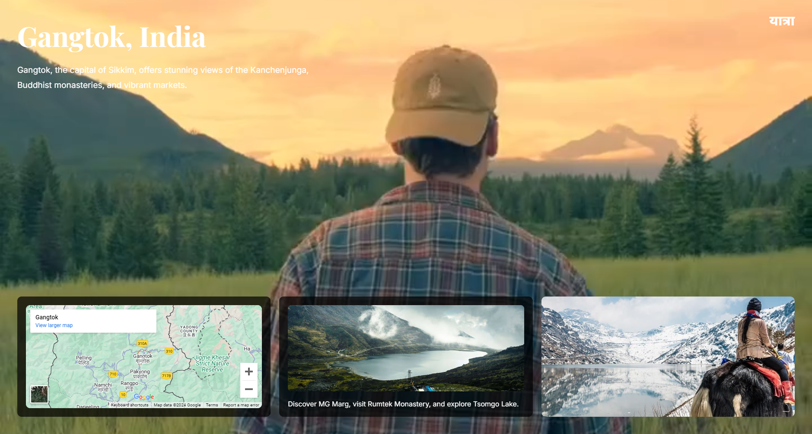
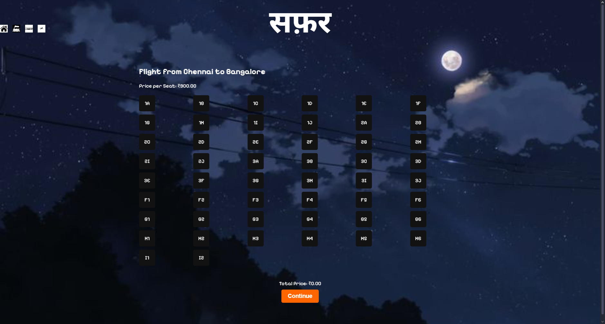
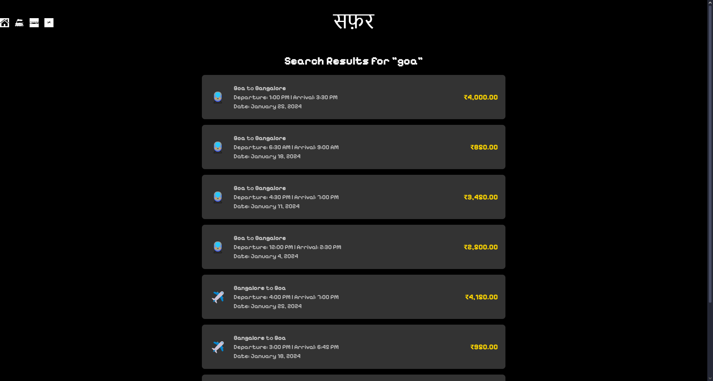
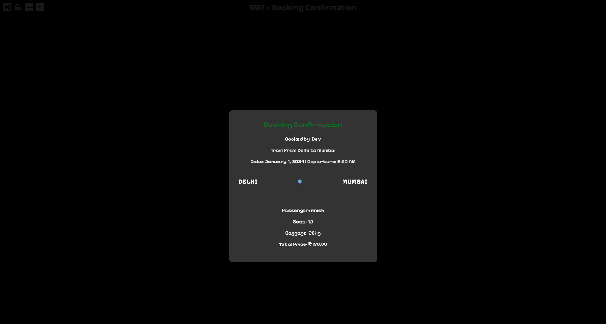

<p align="center">
  <span style="display: flex; align-items: center; justify-content: center; gap: 10px;">
    
  </span>
</p>

<p align="center">
  <a href="https://github.com/Dxv-404/Yaatra">
    
  </a>
  <a href="https://github.com/Dxv-404/Yaatra/stargazers">
    
  </a>
</p>

# 🌍 **यात्रा** 🇮🇳

Welcome to **यात्रा** and **सफ़र**! This integrated platform offers a seamless experience for discovering travel destinations across India and booking trips effortlessly.

---

## 🎯 **Overview**

### 🧭 **Yaatra**
**Yaatra** is designed to help users find the perfect travel destinations in India. It categorizes destinations based on seasons—**Summer**, **Winter**, and **Rain**—providing tailored recommendations for each.

### 🛒 **Safar**
**Safar** complements Yaatra by enabling users to book trips to their chosen destinations. It offers a user-friendly interface to plan and confirm travel arrangements.

---

## 🚀 **Features**

### 🌞❄️🌧️ **Yaatra Highlights**
1. **Seasonal Destination Finder:**
   - Browse destinations suitable for different seasons.
   - Detailed information and images for each location.

2. **Interactive User Interface:**
   - Engaging design with easy navigation.
   - Responsive layout for various devices.

### 🛒✨ **Safar Highlights**
1. **Trip Booking System:**
   - Select destinations and view available packages.
   - Secure booking process with confirmation.

2. **User Account Management:**
   - Create and manage personal accounts.
   - View booking history and upcoming trips.

---

## 🖥️ **Screenshots**

### Yaatra Login Page 💻


### Yaatra Home Page 🌐


### Yaatra Summer Page🌞


### Yaatra Rain Page🌧️


### Yaatra Winter Page❄️


---

### Safar Home Page ✨


### Safar Booking Page 🛒


### Safar Seat Selection Page 💺


### Safar Search Page 🔎


### Safar Confirmation Page ✔️



---

## 📂 **Project Structure**

```plaintext
Yaatra-Safar/
├── assets/                                                       # Images, videos, and other media assets
├── project/
│   ├── index.php                                                 # Login Page for Safar
│   ├── home.php                                                  # Home Page for Safar
│   ├── booking.php                                               # Booking Page for Safar
│   ├── seat_selection_bus.php                                    # Seat Selection Pages for Safar
│   └── ...                                                       # Additional files
├── screenshots/                                                  # Screenshots for README and documentation
├── yaatra.html                                                   # Main HTML for Yaatra
├── yaatra-1.html                                                 # Redirected page
├── rain.html                                                     # Main HTML for Rain Page 
├── summer.html                                                   # HTML for Summer Page
├── winter.html                                                   # HTML for Winter Page
├── yaatra_login.html                                             # HTML for Login Page
└── README.md                                                     # Project documentation
```

---

## 🌟 **Usage**

### 🚀 Run Locally
1. **Clone the repository:**
   ```bash
   git clone https://github.com/Dxv-404/Yaatra.git
   cd Yaatra
   ```

2. **Open the project:**
   - For **Yaatra**, open `yaatra.html` in a modern browser.
   - For **Safar**, open `localhost/project/home.php` in a modern browser.

3. **Customize:**
   - Modify `yaatra.html` or `project/home.html` for styling changes.
   - Update other files like  `rain.html` or `project/booking.php` for additional feature tweaks.

---

## 🔧 **Technologies Used**

- **HTML5**: Structure and content.
- **CSS3**: Styling and layout.
- **JavaScript**: Interactivity and dynamic content.
- **PHP**: Server-side processing.
- **SQL**: Database for Safar

---

## 🌐 **Video Demo**

Experience the platform live: [Yaatra & Safar Video Demo](#)  
**
[](screenshots/screen-capture.mp4)


---

## 🛠️ **Future Enhancements**

- Expand destination database with more locations.
- Implement user reviews and ratings for destinations.
- Enhance booking system with payment gateway integration.
- Optimize for mobile devices for a responsive experience.

---

## 🤝 **Contributing**

We welcome contributions! 🎉

1. **Fork the repository.**
2. **Create a new branch:**
   ```bash
   git checkout -b feature/your-feature
   ```
3. **Make your changes and commit:**
   ```bash
   git commit -m "Add your message here"
   ```
4. **Push your changes and open a pull request:**
   ```bash
   git push origin feature/your-feature
   ```

---

## 📧 **Contact**

For feedback or inquiries:  
📩 **devkrishna6780@gmail.com**  

---

## ⭐ **Show Your Support**

If you like **Yaatra** and **Safar**, please ⭐ this repository and share it with your friends! 🙌
```

### Steps to Fix the Issue:
1. Open your `README.md` file in your GitHub repository or text editor.
2. Replace the current content with the above markdown content.
3. Commit the changes.
4. Verify that the README renders properly on your repository's GitHub page.
